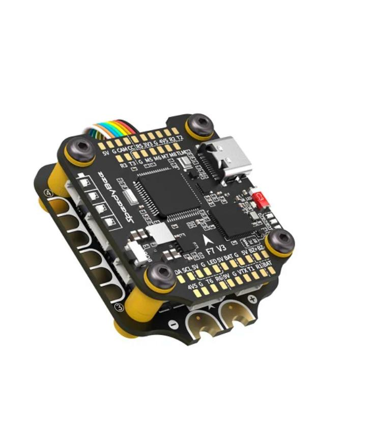
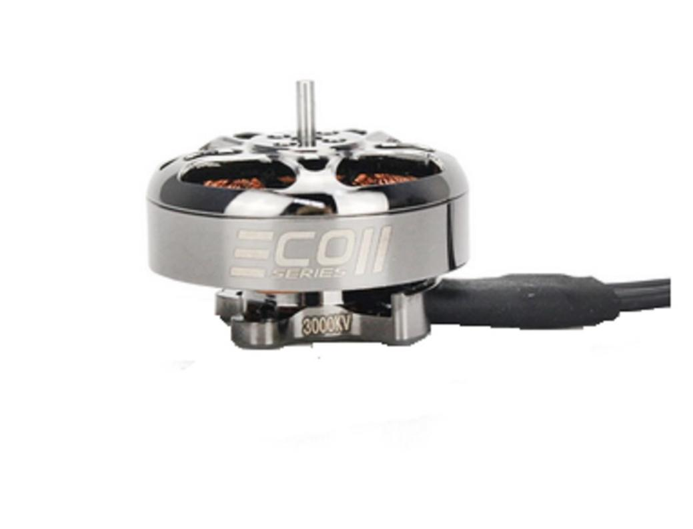
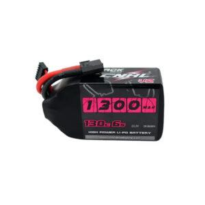
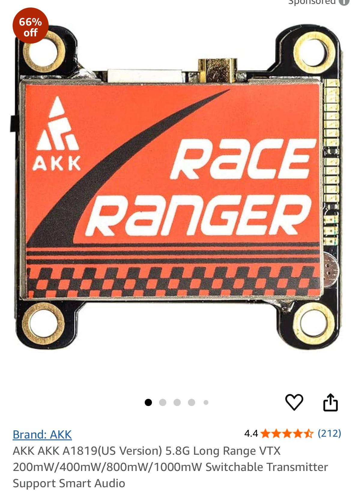
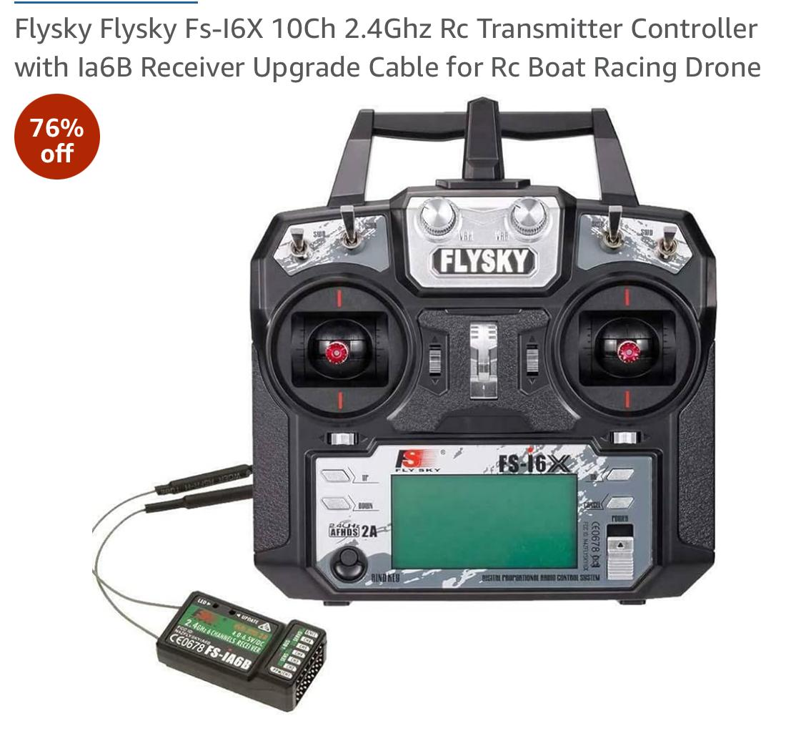
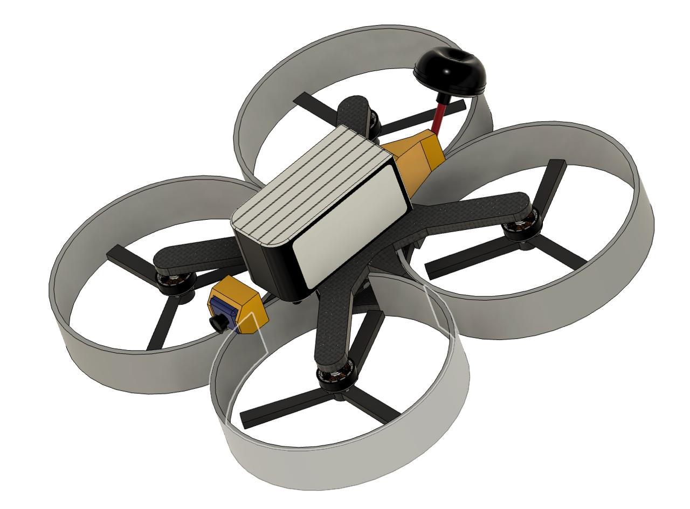
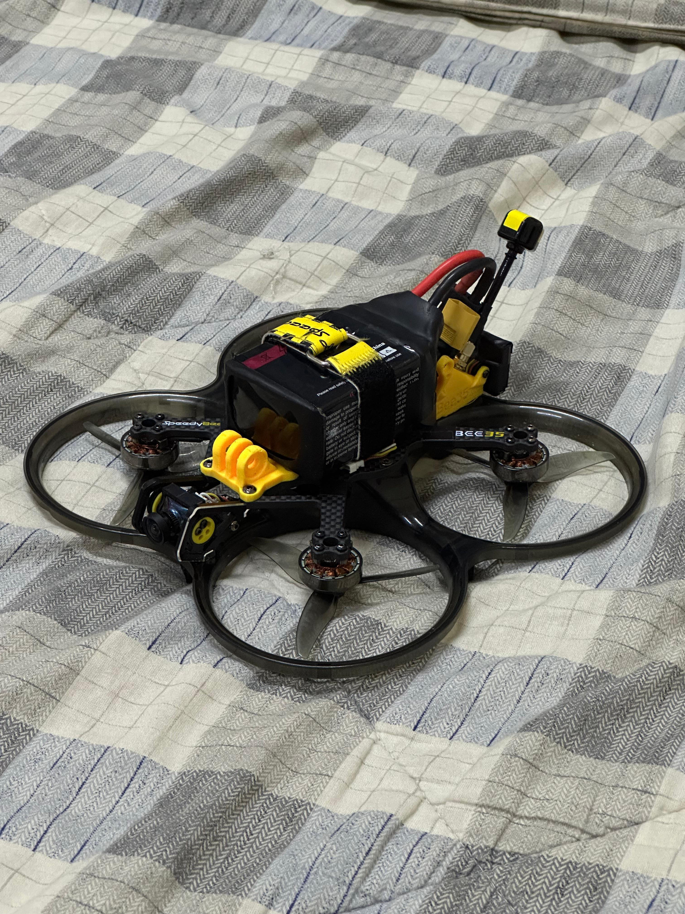

# 🔧 Hardware Architecture – Search & Rescue FPV Drone

This section provides a detailed overview of the complete hardware stack used in the development of the Search & Rescue FPV Drone.

---

## 🏗 Frame Structure

**SpeedyBee Bee35 Pro Frame**

)

- 2mm carbon fiber plate thickness
- Lightweight and impact-resistant
- Designed for high maneuverability
- Vibration-resistant structure

---

## 🧠 Flight Controller

**SpeedyBee F405 V3 Mini (20x20 Stack)**

- STM32 F405 processor
- Built-in Bluetooth
- Integrated barometer
- 6S LiPo compatible

Acts as the central processing unit managing stabilization and motor outputs.

---

## ⚙️ Propulsion System

### 🌀 Motors  
**Emax ECOII-2004-2400KV Brushless Motors (4x)**

- High thrust-to-weight ratio
- Durable reinforced architecture
- Optimized for 6S LiPo configuration

---

## 🔋 Power System

**CNHL Black Series V2.0 1500mAh 22.2V 6S LiPo**

- 1500mAh capacity
- 22.2V (6S)
- 65C–130C discharge rate
- High current output for aggressive maneuvering

---

## 🎥 FPV Camera System

**RunCam Racer Nano 4 (Analog FPV Camera)**

- Ultra-low latency analog output
- High Dynamic Range
- Nano-size lightweight design

Provides real-time visual feed for SAR navigation.

---

## 📡 Video Transmission System

**AKK A1819 5.8GHz Long Range VTX**

- 200/400/800/1000mW switchable power
- Smart Audio supported
- Long-range analog transmission

Transmits camera feed to FPV goggles.

---

## 🎮 Remote Control System

**FlySky FS-i6X 10CH 2.4GHz Transmitter**

- AFHDS2A protocol
- Reliable long-range communication
- 10-channel capability

---

## 👓 Ground Viewing System

**Eachine EV800 FPV Goggles**

- 5.8GHz analog receiver
- Built-in diversity receiver
- Integrated DVR
- Low-latency live viewing

Receives real-time analog transmission from AKK VTX.

---

## 🛩 Complete Drone Assembly

### Drone Model

### System Architecture Diagram

### Final Output Model

---

## 🔄 Hardware Signal Flow Overview

1. FlySky FS-i6X → Receiver  
2. Receiver → SpeedyBee F405 Flight Controller  
3. Flight Controller → ESC → Emax Motors  
4. RunCam Nano 4 → AKK A1819 VTX  
5. AKK VTX → Eachine EV800 Goggles  

---

## 🧩 Design Philosophy

The hardware selection was optimized for:

- Long-range analog reliability
- Ultra-low latency video
- High thrust-to-weight ratio
- Durable SAR deployment
- 6S high-performance power system
